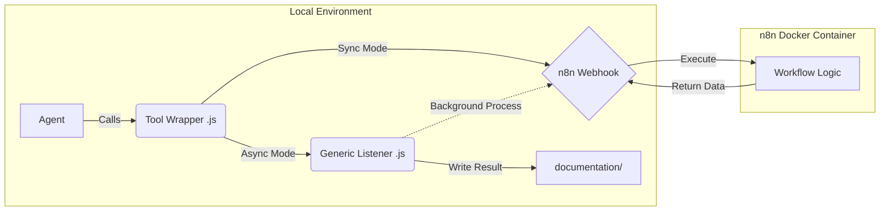

# System Architecture: Agentic Tooling (n8n Integration)

## 1.0 Executive Summary
This document defines the architecture for "Hybrid Agentic Tooling."
*   **Problem:** LLMs running locally (OpenCode) have limited context, high latency for complex logic, and cost constraints.
*   **Solution:** Offload heavy logic, search loops, and document processing to **n8n** workflows running on a local server.
*   **Pattern:** "Fat External / Thin Internal." OpenCode agents act as lightweight triggers; n8n handles the heavy lifting.

## 2.0 Architectural Pattern

### 2.1 Communication Flow
We utilize a **Pure JavaScript** toolchain to minimize dependencies (no Python required).



### 2.2 Execution Modes
1.  **Synchronous (Blocking):** For fast tasks (<30s). The Agent waits for the HTTP response.
    *   *Example:* Quick Fact Check.
2.  **Asynchronous (Fire-and-Forget):** For long tasks (>30s). The Agent spawns a detached process and continues working. The process writes the result to disk later.
    *   *Example:* Deep Research, Doc Ingestion.

## 3.0 Component Specifications

### 3.1 Directory Structure
| Path | Purpose |
| :--- | :--- |
| `.opencode/tool/*.js` | **Tool Definitions.** The schema visible to the LLM. |
| `.opencode/scripts/n8n_listener.js` | **The Bridge.** A generic Node.js script that handles async HTTP requests and file writing. |
| `documentation/` | **Output Target.** Where async tools deposit their results. |

### 3.2 The Generic Listener (`n8n_listener.js`)
*   **Role:** Handles long-running requests without blocking the Agent's terminal.
*   **Inputs (CLI Args):** `[URL] [JSON_PAYLOAD] [OUTPUT_FILE_PATH]`
*   **Logic:**
    1.  Parse arguments.
    2.  Send `POST` request to `URL` with `JSON_PAYLOAD`.
    3.  Wait (no timeout limit).
    4.  On success: Write `response.body.content` to `OUTPUT_FILE_PATH`.
    5.  On fail: Write error details to `OUTPUT_FILE_PATH`.

### 3.3 Tool Definitions (Reference Implementation)

#### Type A: Synchronous Tool (e.g., `research_quick`)
*   **Mechanism:** Uses native `fetch` inside the `execute()` block.
*   **Code Pattern:**
    ```javascript
    // Pseudo-code reference
    const response = await fetch(N8N_WEBHOOK_URL, { body: JSON.stringify(args) });
    return await response.text(); // Return directly to context
    ```

#### Type B: Asynchronous Tool (e.g., `research_deep`, `ingest_url`)
*   **Mechanism:** Uses `child_process.spawn` to trigger the Listener.
*   **Code Pattern:**
    ```javascript
    // Pseudo-code reference
    const { spawn } = require("child_process");
    const child = spawn("node", ["scripts/n8n_listener.js", URL, payload, filepath], {
        detached: true,
        stdio: "ignore"
    });
    child.unref(); // Critical: Allows Agent to stop waiting
    return `Started. Check ${filepath} later.`;
    ```

## 4.0 The n8n Workflow Contract

The Agent must guide the User to build n8n workflows that adhere to this strict contract:

### 4.1 Interface
*   **Trigger:** `Webhook` (POST).
*   **Authentication:** None (Internal Network) or Basic Auth (if required).
*   **Input Data:** JSON body containing tool arguments (e.g., `{ "query": "..." }`).

### 4.2 Required Nodes (Logic)
*   **Research Tools:** `Serper Dev` / `Google Books` / `Scraper` $\to$ `LLM Chain` (Synthesizer).
*   **Ingest Tools:** `HTTP Request` (Get URL) $\to$ `HTML to Markdown` $\to$ `Text Cleaner`.

### 4.3 Output Format
*   **Response:** The workflow **MUST** return a JSON object with a specific key expected by the Listener (e.g., `content` or `markdown`).
*   **Node:** End with a `Respond to Webhook` node.

## 5.0 Implementation Checklist for the Agent

The Agent assigned to this task must execute the following logic:

1.  **Configuration Discovery:**
    *   Ask user for the local n8n Server IP/URL (e.g., `http://192.168.1.50:5678`).
    *   Ask user for desired filenames for the tools.

2.  **Infrastructure Setup:**
    *   Create directory `.opencode/scripts/`.
    *   Generate `.opencode/scripts/n8n_listener.js` (Robust error handling required).

3.  **Tool Generation:**
    *   Generate `.opencode/tool/research_quick.js`.
    *   Generate `.opencode/tool/research_deep.js`.
    *   Generate `.opencode/tool/ingest_url.js`.

4.  **n8n Guidance (Interactive):**
    *   *Stop and wait.* Instruct the user to create the specific workflows in n8n.
    *   Provide the **cURL** test command for the user to verify the workflow works before connecting OpenCode.

5.  **Final Verification:**
    *   Run a test invocation of the synchronous tool.
    *   Run a test invocation of the asynchronous tool and check `documentation/` for the result.
