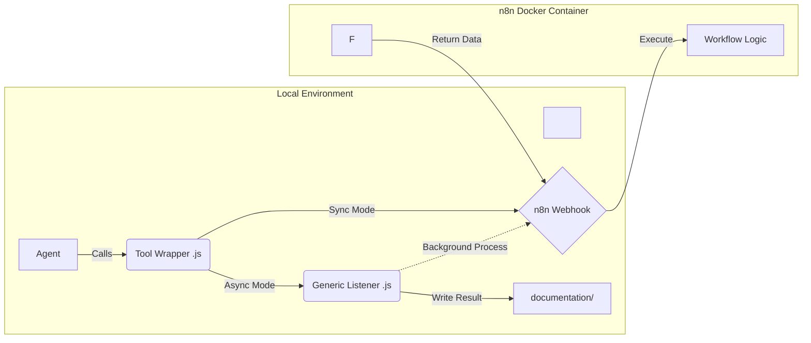

\# System Architecture: Agentic Tooling (n8n Integration)


\## 1.0 Executive Summary

This document defines the architecture for "Hybrid Agentic Tooling."

\*   \*\*Problem:\*\* LLMs running locally (OpenCode) have limited context, high latency for complex logic, and cost constraints.

\*   \*\*Solution:\*\* Offload heavy logic, search loops, and document processing to \*\*n8n\*\* workflows running on a local server.

\*   \*\*Pattern:\*\* "Fat External / Thin Internal." OpenCode agents act as lightweight triggers; n8n handles the heavy lifting.


\## 2.0 Architectural Pattern


\### 2.1 Communication Flow

We utilize a \*\*Pure JavaScript\*\* toolchain to minimize dependencies (no Python required).





\### 2.2 Execution Modes

1\.  \*\*Synchronous (Blocking):\*\* For fast tasks (<30s). The Agent waits for the HTTP response.

&nbsp;   \*   \*Example:\* Quick Fact Check.

2\.  \*\*Asynchronous (Fire-and-Forget):\*\* For long tasks (>30s). The Agent spawns a detached process and continues working. The process writes the result to disk later.

&nbsp;   \*   \*Example:\* Deep Research, Doc Ingestion.


\## 3.0 Component Specifications


\### 3.1 Directory Structure

| Path | Purpose |

| :--- | :--- |

| `.opencode/tool/\*.js` | \*\*Tool Definitions.\*\* The schema visible to the LLM. |

| `.opencode/scripts/n8n\_listener.js` | \*\*The Bridge.\*\* A generic Node.js script that handles async HTTP requests and file writing. |

| `documentation/` | \*\*Output Target.\*\* Where async tools deposit their results. |


\### 3.2 The Generic Listener (`n8n\_listener.js`)

\*   \*\*Role:\*\* Handles long-running requests without blocking the Agent's terminal.

\*   \*\*Inputs (CLI Args):\*\* `\[URL] \[JSON\_PAYLOAD] \[OUTPUT\_FILE\_PATH]`

\*   \*\*Logic:\*\*

&nbsp;   1.  Parse arguments.

&nbsp;   2.  Send `POST` request to `URL` with `JSON\_PAYLOAD`.

&nbsp;   3.  Wait (no timeout limit).

&nbsp;   4.  On success: Write `response.body.content` to `OUTPUT\_FILE\_PATH`.

&nbsp;   5.  On fail: Write error details to `OUTPUT\_FILE\_PATH`.


\### 3.3 Tool Definitions (Reference Implementation)


\#### Type A: Synchronous Tool (e.g., `research\_quick`)

\*   \*\*Mechanism:\*\* Uses native `fetch` inside the `execute()` block.

\*   \*\*Code Pattern:\*\*

&nbsp;   ```javascript

&nbsp;   // Pseudo-code reference

&nbsp;   const response = await fetch(N8N\_WEBHOOK\_URL, { body: JSON.stringify(args) });

&nbsp;   return await response.text(); // Return directly to context

&nbsp;   ```


\#### Type B: Asynchronous Tool (e.g., `research\_deep`, `ingest\_url`)

\*   \*\*Mechanism:\*\* Uses `child\_process.spawn` to trigger the Listener.

\*   \*\*Code Pattern:\*\*

&nbsp;   ```javascript

&nbsp;   // Pseudo-code reference

&nbsp;   const { spawn } = require("child\_process");

&nbsp;   const child = spawn("node", \["scripts/n8n\_listener.js", URL, payload, filepath], {

&nbsp;       detached: true,

&nbsp;       stdio: "ignore"

&nbsp;   });

&nbsp;   child.unref(); // Critical: Allows Agent to stop waiting

&nbsp;   return `Started. Check ${filepath} later.`;

&nbsp;   ```


\## 4.0 The n8n Workflow Contract


The Agent must guide the User to build n8n workflows that adhere to this strict contract:


\### 4.1 Interface

\*   \*\*Trigger:\*\* `Webhook` (POST).

\*   \*\*Authentication:\*\* None (Internal Network) or Basic Auth (if required).

\*   \*\*Input Data:\*\* JSON body containing tool arguments (e.g., `{ "query": "..." }`).


\### 4.2 Required Nodes (Logic)

\*   \*\*Research Tools:\*\* `Serper Dev` / `Google Books` / `Scraper` $\\to$ `LLM Chain` (Synthesizer).

\*   \*\*Ingest Tools:\*\* `HTTP Request` (Get URL) $\\to$ `HTML to Markdown` $\\to$ `Text Cleaner`.


\### 4.3 Output Format

\*   \*\*Response:\*\* The workflow \*\*MUST\*\* return a JSON object with a specific key expected by the Listener (e.g., `content` or `markdown`).

\*   \*\*Node:\*\* End with a `Respond to Webhook` node.


\## 5.0 Implementation Checklist for the Agent


The Agent assigned to this task must execute the following logic:


1\.  \*\*Configuration Discovery:\*\*

&nbsp;   \*   Ask user for the local n8n Server IP/URL (e.g., `http://192.168.1.50:5678`).

&nbsp;   \*   Ask user for desired filenames for the tools.


2\.  \*\*Infrastructure Setup:\*\*

&nbsp;   \*   Create directory `.opencode/scripts/`.

&nbsp;   \*   Generate `.opencode/scripts/n8n\_listener.js` (Robust error handling required).


3\.  \*\*Tool Generation:\*\*

&nbsp;   \*   Generate `.opencode/tool/research\_quick.js`.

&nbsp;   \*   Generate `.opencode/tool/research\_deep.js`.

&nbsp;   \*   Generate `.opencode/tool/ingest\_url.js`.


4\.  \*\*n8n Guidance (Interactive):\*\*

&nbsp;   \*   \*Stop and wait.\* Instruct the user to create the specific workflows in n8n.

&nbsp;   \*   Provide the \*\*cURL\*\* test command for the user to verify the workflow works before connecting OpenCode.


5\.  \*\*Final Verification:\*\*

&nbsp;   \*   Run a test invocation of the synchronous tool.

&nbsp;   \*   Run a test invocation of the asynchronous tool and check `documentation/` for the result.

